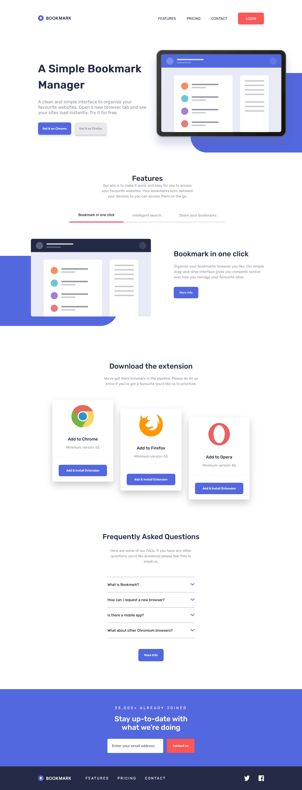

# Frontend Mentor - Bookmark landing page solution

This is a solution to the [Bookmark landing page challenge on Frontend Mentor](https://www.frontendmentor.io/challenges/bookmark-landing-page-5d0b588a9edda32581d29158). Frontend Mentor challenges help you improve your coding skills by building realistic projects. 

## Table of contents

- [Frontend Mentor - Bookmark landing page solution](#frontend-mentor---bookmark-landing-page-solution)
  - [Table of contents](#table-of-contents)
  - [Overview](#overview)
    - [The challenge](#the-challenge)
    - [Screenshot](#screenshot)
    - [Links](#links)
    - [Built with](#built-with)
    - [What I learned](#what-i-learned)
    - [Continued development](#continued-development)
    - [Useful resources](#useful-resources)
  - [Author](#author)

## Overview

### The challenge

Users should be able to:

- View the optimal layout for the site depending on their device's screen size
- See hover states for all interactive elements on the page
- Receive an error message when the newsletter form is submitted if:
  - The input field is empty
  - The email address is not formatted correctly

### Screenshot




### Links

- Solution URL: [Github Link](https://github.com/Dla2/Bookmark-landing-page.git)
- Live Site URL: [Live Link](https://bookmark-home-page.netlify.app/)

### Built with

- Semantic HTML5 markup
- CSS custom properties
- Flexbox
- CSS Grid
- Mobile-first workflow
- [Vue](https://vuejs.org/) - JS library

### What I learned
I learnerd a little bit about form validation in vue with yup and vee-validate

```js
const { values, defineInputBinds, errors }= useForm({
    validationSchema: yup.object({
        email: yup.string().required().email()
    })
});
const email = defineInputBinds('email')

const hasError = computed(() => {
    if(errors.value.email) {
        return true
    } else {
        return false
    }
})
```

### Continued development

I would like to make this more responsive and add more breakpoint instead of just mobile and desktop.

### Useful resources

- [vue Docs](https://vuejs.org/) - This helped me with certain parts of the framework I still am not fully aware of.
- [Vee-Validate Docs](https://vee-validate.logaretm.com/v4/guide/composition-api/getting-started/) - This was an amazing and easy to follow artickle on how to validate your forms with vee-validate and yup

## Author

- Frontend Mentor - [@Dla2](https://www.frontendmentor.io/profile/Dla2)
- Twitter - [@sentetechdev](https://twitter.com/sentetechdev)


